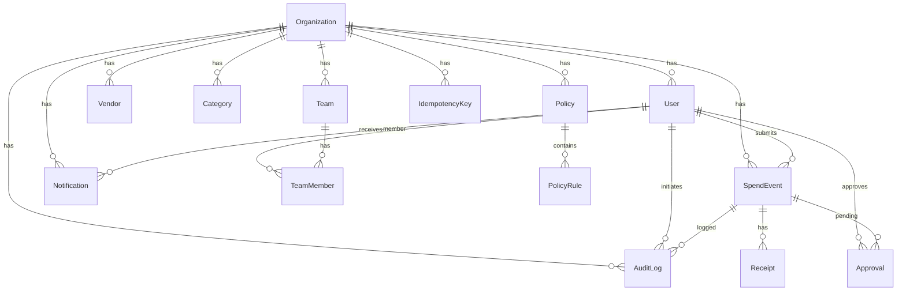

# fastapi

# Spendin Backend Documentation

This documentation covers the core backend components of the Spendin application. It explains each file’s purpose, key classes/functions, and how they relate to one another.

---

## Project Overview

Spendin manages **expense submissions**, **policy evaluations**, **approvals**, and **audit logging** in a unified workflow:

- Users submit expenses → a `SpendEvent` is created
- Active **Policies** evaluate the event → may trigger **Approval** or **Block**
- **Receipts** can be uploaded and OCR-processed via Gemini LLM
- Approved spends finalize and emit accounting outputs
- All actions generate **AuditLog** entries

---

## backend/models/models.py

Defines the database schema using Tortoise ORM. Every table shares common fields via `BaseModel`.

```python
class BaseModel(Model):
    id = UUIDField(pk=True, default=uuid.uuid4)
    created_at = DatetimeField(auto_now_add=True)
    updated_at = DatetimeField(auto_now=True)
    class Meta:
        abstract = True
```

### Key Models

| Model | Purpose |
| --- | --- |
| **Organization** | Tenant grouping; owns users, teams, policies. |
| **User** | Person with roles; linked to an organization. |
| **Team**, **TeamMember** | Grouping of users for spend assignment. |
| **Vendor**, **Category** | Spend metadata classification. |
| **SpendEvent** | Core expense record; amount, currency, status. |
| **Receipt** | File URL + extracted JSON data; verification flag. |
| **Policy** | Org-scoped rules container. |
| **PolicyRule** | Condition → Action JSON + priority. |
| **Approval** | Approver record for spends requiring review. |
| **IdempotencyKey** | Prevent duplicate processing. |
| **Notification** | In-app notifications for users. |
| **AuditLog** | Immutable log of entity actions. |


#### Entity-Relationship Diagram



---

## Database Initialization: `backend/db.py`

Configures and initializes Tortoise ORM.

```python
TORTOISE_ORM = {
  "connections": {"default": settings.db_url},
  "apps": {"models": {
    "models": ["models.models", "aerich.models"],
    "default_connection": "default"
  }}
}
```

- **init_db**: connects to DB
- **close_db**: closes connections

---

## Configuration: `backend/auth/config.py`

Loads environment variables via `python-dotenv` and caches settings.

```python
class Settings:
  def __init__(self):
    self.auth0_domain = os.getenv("AUTH0_DOMAIN")
    ...
    self.db_url = os.getenv("DB_URL")

@lru_cache()
def get_settings() -> Settings:
  return Settings()
```

- Holds **Auth0**, **Gemini**, and **DB** credentials.

---

## Authentication Dependency: `backend/auth/dependencies.py`

Integrates Auth0 with FastAPI.

```python
async def get_current_user(claims=Depends(auth0.require_auth())):
    auth_id = claims.get("sub")
    ...
    user = await User.get_or_none(auth_id=auth_id)
    if not user: raise HTTPException(403,"User not provisioned")
    user.role = claims.get(settings.namespace + "/roles", [])
    return user
```

- Fetches or denies access based on JWT claims.

---

## Authorization Guard: `backend/auth/permissions.py`

```python
def require_role(*allowed_roles):
  async def checker(user=Depends(get_current_user)):
    if not any(r.value in user.role for r in allowed_roles):
      raise HTTPException(403,"Insufficient permissions")
    return user
  return checker
```

- Applies role-based access control.

---

## Roles Enumeration: `backend/auth/roles.py`

```python
class Role(str, Enum):
    EMPLOYEE = "employee"
    MANAGER  = "manager"
    FINANCE  = "finance"
    ADMIN    = "admin"
```

---

## Admin User Routes: `backend/routes/admins.py`

Manage user provisioning and deletion.

### GET /admin/users

```api
{
    "title": "List Users",
    "description": "Retrieve all users",
    "method": "GET",
    "baseUrl": "http://localhost:8000",
    "endpoint": "/admin/users",
    "headers": [],
    "queryParams": [],
    "pathParams": [],
    "bodyType": "none",
    "requestBody": "",
    "formData": [],
    "rawBody": "",
    "responses": {
        "200": {
            "description": "List of users",
            "body": "[ { \"id\": \"...\", \"email\": \"...\" } ]"
        }
    }
}
```

### POST /admin/users

```api
{
    "title": "Create User",
    "description": "Provision a new user",
    "method": "POST",
    "baseUrl": "http://localhost:8000",
    "endpoint": "/admin/users",
    "headers": [],
    "queryParams": [],
    "pathParams": [],
    "bodyType": "json",
    "requestBody": "{ \"email\": \"john@example.com\", \"full_name\": \"John Doe\", \"role\": \"employee\" }",
    "formData": [],
    "rawBody": "",
    "responses": {
        "200": {
            "description": "Created user",
            "body": "{ \"id\": \"...\", \"email\": \"john@example.com\" }"
        }
    }
}
```

### GET /admin/users/{user_id}

```api
{
    "title": "Get User",
    "description": "Retrieve user by ID",
    "method": "GET",
    "baseUrl": "http://localhost:8000",
    "endpoint": "/admin/users/{user_id}",
    "headers": [
        {
            "key": "Authorization",
            "value": "Bearer <token>",
            "required": true
        }
    ],
    "queryParams": [],
    "pathParams": [
        {
            "key": "user_id",
            "value": "UUID",
            "required": true
        }
    ],
    "bodyType": "none",
    "requestBody": "",
    "formData": [],
    "rawBody": "",
    "responses": {
        "200": {
            "description": "User object",
            "body": "{ \"id\": \"...\", \"email\": \"...\" }"
        },
        "404": {
            "description": "Not found",
            "body": "{ \"detail\": \"User not found\" }"
        }
    }
}
```

### DELETE /admin/users/{user_id}

```api
{
    "title": "Delete User",
    "description": "Remove a user",
    "method": "DELETE",
    "baseUrl": "http://localhost:8000",
    "endpoint": "/admin/users/{user_id}",
    "headers": [
        {
            "key": "Authorization",
            "value": "Bearer <token>",
            "required": true
        }
    ],
    "queryParams": [],
    "pathParams": [
        {
            "key": "user_id",
            "value": "UUID",
            "required": true
        }
    ],
    "bodyType": "none",
    "requestBody": "",
    "formData": [],
    "rawBody": "",
    "responses": {
        "200": {
            "description": "Success",
            "body": "{ \"message\": \"Deleted successfully\" }"
        },
        "404": {
            "description": "Not found",
            "body": "{ \"detail\": \"User not found\" }"
        }
    }
}
```

---

## Policy Management Routes: `backend/routes/policies.py`

Allows creation, listing, and updating of spending policies.

### POST /policies

```api
{
    "title": "Create Policy",
    "description": "Define a new spending policy",
    "method": "POST",
    "baseUrl": "http://localhost:8000",
    "endpoint": "/policies",
    "headers": [
        {
            "key": "Authorization",
            "value": "Bearer <token>",
            "required": true
        }
    ],
    "queryParams": [],
    "pathParams": [],
    "bodyType": "json",
    "requestBody": "{\n  \"name\": \"HighValue\",\n  \"is_active\": true,\n  \"rules\": [ { \"condition\": {\"amount_gt\": 500}, \"action\": {\"type\":\"require_approval\"}, \"priority\":1 } ]\n}",
    "formData": [],
    "rawBody": "",
    "responses": {
        "200": {
            "description": "PolicyResponse",
            "body": "{ \"id\":\"...\",\"name\":\"HighValue\",\"rules\":[...] }"
        },
        "403": {
            "description": "Forbidden",
            "body": "{ \"detail\":\"Insufficient permissions\" }"
        }
    }
}
```

### GET /policies

```api
{
    "title": "List Policies",
    "description": "Fetch all policies for organization",
    "method": "GET",
    "baseUrl": "http://localhost:8000",
    "endpoint": "/policies",
    "headers": [
        {
            "key": "Authorization",
            "value": "Bearer <token>",
            "required": true
        }
    ],
    "queryParams": [],
    "pathParams": [],
    "bodyType": "none",
    "requestBody": "",
    "formData": [],
    "rawBody": "",
    "responses": {
        "200": {
            "description": "Array of policies",
            "body": "[{ \"id\":\"...\",\"name\":\"...\",\"rules\":[...] }]"
        }
    }
}
```

### PATCH /policies/{policy_id}

```api
{
    "title": "Update Policy",
    "description": "Modify an existing policy",
    "method": "PATCH",
    "baseUrl": "http://localhost:8000",
    "endpoint": "/policies/{policy_id}",
    "headers": [
        {
            "key": "Authorization",
            "value": "Bearer <token>",
            "required": true
        }
    ],
    "queryParams": [],
    "pathParams": [
        {
            "key": "policy_id",
            "value": "UUID",
            "required": true
        }
    ],
    "bodyType": "json",
    "requestBody": "{ \"name\":\"Updated\",\"is_active\":false,\"rules\":[] }",
    "formData": [],
    "rawBody": "",
    "responses": {
        "200": {
            "description": "Updated policy",
            "body": "{ ... }"
        },
        "404": {
            "description": "Not found",
            "body": "{ \"detail\":\"Policy not found\" }"
        }
    }
}
```

---

## User Profile Route: `backend/routes/users.py`

### GET /users/me

```api
{
    "title": "Get Profile",
    "description": "Retrieve current user",
    "method": "GET",
    "baseUrl": "http://localhost:8000",
    "endpoint": "/users/me",
    "headers": [
        {
            "key": "Authorization",
            "value": "Bearer <token>",
            "required": true
        }
    ],
    "queryParams": [],
    "pathParams": [],
    "bodyType": "none",
    "requestBody": "",
    "formData": [],
    "rawBody": "",
    "responses": {
        "200": {
            "description": "User info",
            "body": "{ \"id\":\"...\",\"email\":\"...\" }"
        }
    }
}
```

---

## Receipt Upload Route: `backend/routes/receipts.py`

### POST /receipts

```api
{
    "title": "Upload Receipt",
    "description": "Attach a receipt to a spend event",
    "method": "POST",
    "baseUrl": "http://localhost:8000",
    "endpoint": "/receipts",
    "headers": [
        {
            "key": "Authorization",
            "value": "Bearer <token>",
            "required": true
        }
    ],
    "queryParams": [],
    "pathParams": [],
    "bodyType": "form",
    "requestBody": "",
    "formData": [
        {
            "key": "file",
            "value": "file",
            "required": true
        },
        {
            "key": "spend_id",
            "value": "UUID",
            "required": true
        }
    ],
    "rawBody": "",
    "responses": {
        "200": {
            "description": "Receipt created",
            "body": "{ \"id\":\"...\",\"file_url\":\"...\" }"
        },
        "404": {
            "description": "Spend not found",
            "body": "{ \"detail\":\"Spend event not found\" }"
        }
    }
}
```

---

## Spend Events Routes: `backend/routes/spends.py`

### GET /spends

```api
{
    "title": "List Spends",
    "description": "Retrieve spends with filters",
    "method": "GET",
    "baseUrl": "http://localhost:8000",
    "endpoint": "/spends",
    "headers": [
        {
            "key": "Authorization",
            "value": "Bearer <token>",
            "required": true
        }
    ],
    "queryParams": [
        {
            "key": "limit",
            "value": "Page size",
            "required": false
        },
        {
            "key": "offset",
            "value": "Page offset",
            "required": false
        },
        {
            "key": "status",
            "value": "Filter by status",
            "required": false
        }
    ],
    "pathParams": [],
    "bodyType": "none",
    "requestBody": "",
    "formData": [],
    "rawBody": "",
    "responses": {
        "200": {
            "description": "Paged spends",
            "body": "{ \"total\":100,\"items\":[ ... ] }"
        }
    }
}
```

### POST /spends

```api
{
    "title": "Create Spend",
    "description": "Submit a new spend event",
    "method": "POST",
    "baseUrl": "http://localhost:8000",
    "endpoint": "/spends",
    "headers": [
        {
            "key": "Authorization",
            "value": "Bearer <token>",
            "required": true
        }
    ],
    "queryParams": [],
    "pathParams": [],
    "bodyType": "json",
    "requestBody": "{ \"amount\":123.45, \"currency\":\"USD\", \"spend_date\":\"2024-06-01\", \"source\":\"manual\", \"category_id\":null }",
    "formData": [],
    "rawBody": "",
    "responses": {
        "200": {
            "description": "Created spend",
            "body": "{ \"id\":\"...\",\"status\":\"pending\" }"
        }
    }
}
```

---

## Approval Decision Route: `backend/routes/approvals.py`

### POST /approvals/{approval_id}/decision

```api
{
    "title": "Decide Approval",
    "description": "Approve or reject a spend",
    "method": "POST",
    "baseUrl": "http://localhost:8000",
    "endpoint": "/approvals/{approval_id}/decision",
    "headers": [
        {
            "key": "Authorization",
            "value": "Bearer <token>",
            "required": true
        }
    ],
    "queryParams": [],
    "pathParams": [
        {
            "key": "approval_id",
            "value": "UUID",
            "required": true
        }
    ],
    "bodyType": "json",
    "requestBody": "{ \"approved\": true, \"comment\": \"Looks good\" }",
    "formData": [],
    "rawBody": "",
    "responses": {
        "200": {
            "description": "OK",
            "body": "{ \"status\":\"ok\" }"
        },
        "403": {
            "description": "Forbidden",
            "body": "{ \"detail\":\"Not allowed\" }"
        },
        "404": {
            "description": "Not found",
            "body": "{ \"detail\":\"Approval not found\" }"
        }
    }
}
```

---

## Audit Log Routes: `backend/routes/audit_logs.py`

### GET /audit-logs

```api
{
    "title": "List Audit Logs",
    "description": "Fetch audit trail entries",
    "method": "GET",
    "baseUrl": "http://localhost:8000",
    "endpoint": "/audit-logs",
    "headers": [
        {
            "key": "Authorization",
            "value": "Bearer <token>",
            "required": true
        }
    ],
    "queryParams": [
        {
            "key": "limit",
            "value": "Max items",
            "required": false
        },
        {
            "key": "offset",
            "value": "Skip items",
            "required": false
        },
        {
            "key": "action",
            "value": "Filter by action",
            "required": false
        }
    ],
    "pathParams": [],
    "bodyType": "none",
    "requestBody": "",
    "formData": [],
    "rawBody": "",
    "responses": {
        "200": {
            "description": "Paged audit logs",
            "body": "{ \"total\":50,\"items\":[...] }"
        }
    }
}
```

---

## Auth0 Event Webhook: `backend/routes/events.py`

### POST /events/webhook

```api
{
    "title": "Handle Auth0 Webhook",
    "description": "Process Auth0 stream events",
    "method": "POST",
    "baseUrl": "http://localhost:8000",
    "endpoint": "/events/webhook",
    "headers": [
        {
            "key": "x-webhook-secret",
            "value": "<secret>",
            "required": true
        }
    ],
    "queryParams": [],
    "pathParams": [],
    "bodyType": "json",
    "requestBody": "[ { \"type\":\"user.created\",\"data\":{...} } ]",
    "formData": [],
    "rawBody": "",
    "responses": {
        "200": {
            "description": "Accepted",
            "body": "{ \"status\":\"accepted\" }"
        },
        "401": {
            "description": "Unauthorized",
            "body": "{ \"detail\":\"Unauthorized webhook source\" }"
        }
    }
}
```

---

## Notification Routes: `backend/routes/notifications.py`

### GET /notifications

```api
{
    "title": "List Notifications",
    "description": "Retrieve user notifications",
    "method": "GET",
    "baseUrl": "http://localhost:8000",
    "endpoint": "/notifications",
    "headers": [
        {
            "key": "Authorization",
            "value": "Bearer <token>",
            "required": true
        }
    ],
    "queryParams": [
        {
            "key": "unread_only",
            "value": "Filter unread",
            "required": false
        },
        {
            "key": "limit",
            "value": "Page size",
            "required": false
        }
    ],
    "pathParams": [],
    "bodyType": "none",
    "requestBody": "",
    "formData": [],
    "rawBody": "",
    "responses": {
        "200": {
            "description": "Paged notifications",
            "body": "{ \"total\":10,\"items\":[...] }"
        }
    }
}
```

### POST /notifications/{notification_id}/read

```api
{
    "title": "Mark Read",
    "description": "Mark a notification as read",
    "method": "POST",
    "baseUrl": "http://localhost:8000",
    "endpoint": "/notifications/{notification_id}/read",
    "headers": [
        {
            "key": "Authorization",
            "value": "Bearer <token>",
            "required": true
        }
    ],
    "queryParams": [],
    "pathParams": [
        {
            "key": "notification_id",
            "value": "UUID",
            "required": true
        }
    ],
    "bodyType": "none",
    "requestBody": "",
    "formData": [],
    "rawBody": "",
    "responses": {
        "200": {
            "description": "OK",
            "body": "{ \"status\":\"ok\" }"
        },
        "404": {
            "description": "Not found",
            "body": "{ \"status\":\"not_found\" }"
        }
    }
}
```

---

## User Service: `backend/services/user_service.py`

Manages Auth0-driven user sync and deactivation.

- **delete_user_from_auth0**: soft-deactivate user
- **sync_user_roles_from_auth0**: align roles
- **handle_role_assignment**: react to membership events
- **initialize_organization_workspace**: bootstrap org + defaults

---

## Gemini OCR Service: `backend/services/gemini_service.py`

Uses LangChain + Google Gemini for structured extraction.

```python
async def extract_receipt_data(file_bytes=None, text_content=None) -> InvoiceData:
    # Accepts image or text
    ...
    response = await structured_llm.ainvoke([SYSTEM_PROMPT, human_message])
    return response
```

- Returns `InvoiceData` pydantic model.

---

## Audit Logging: `backend/services/audit_service.py`

```python
async def log_action(*, organization, actor, entity, action, metadata=None):
    await AuditLog.create(
      organization=organization,
      actor=actor,
      entity_type=entity.__class__.__name__,
      entity_id=entity.id,
      action=action,
      metadata=metadata
    )
```

- Centralized event logging.

---

## Approver Selection: `backend/services/approver_service.py`

Determines approver from active policies.

```python
async def select_approver(spend: SpendEvent) -> User | None:
    # Loop sorted policy rules; return first matching user
```

---

## Approval Workflow: `backend/services/approval_service.py`

Coordinates creation and resolution of approvals.

- **request_approval**: assigns approver, notifies, logs
- **resolve_approval**: updates spend status, logs outcome

---

## Policy Engine: `backend/services/policy_service.py`

Evaluates JSON-based rules against spends.

- **evaluate_policies**: fetch active policies, match conditions
- **_match_condition**: field-to-value comparison
- **_apply_actions**: triggers approvals, auto-approve, block

---

## Spend Management: `backend/services/spend_service.py`

Handles core spend creation and status transitions.

- **create_spend_event**: idempotent creation, logs, triggers policy eval

---

## Receipt Processing: `backend/services/receipt_service.py`

Attaches receipts, runs OCR, updates spend.

- **attach_receipt**: create `Receipt`, schedule `_process_receipt_ocr`
- **_process_receipt_ocr**: extract data, mark verified, re-evaluate policies, log

---

## CLI Bootstrap: `backend/create_suser.py`

Command-line tool to create an initial superuser and organization.

- Uses **IdempotencyKey** to avoid duplicates
- Hashes password with `bcrypt`

---

## Environment Template: `backend/.env.example`

```dotenv
AUTH0_DOMAIN=
AUTH0_API_AUDIENCE=
GEMINI_API_KEY=
...
DB_URL="sqlite://db.sqlite3"
```

- Defines required variables for Auth0, Gemini, and DB.

---

🎉 With these components, Spendin orchestrates expense intake, policy enforcement, approval routing, receipt verification, and audit compliance in a scalable, event-driven architecture.

---
Source: https://app.docuwriter.ai/s/g/share/d03eb93d-ff8b-4540-8eb5-7bee34c99c2c/t-sp-m-i?signature=3043e50a36e033658865ea5349b7761e30aabe1117774facf7efaa5cd212b3b3
